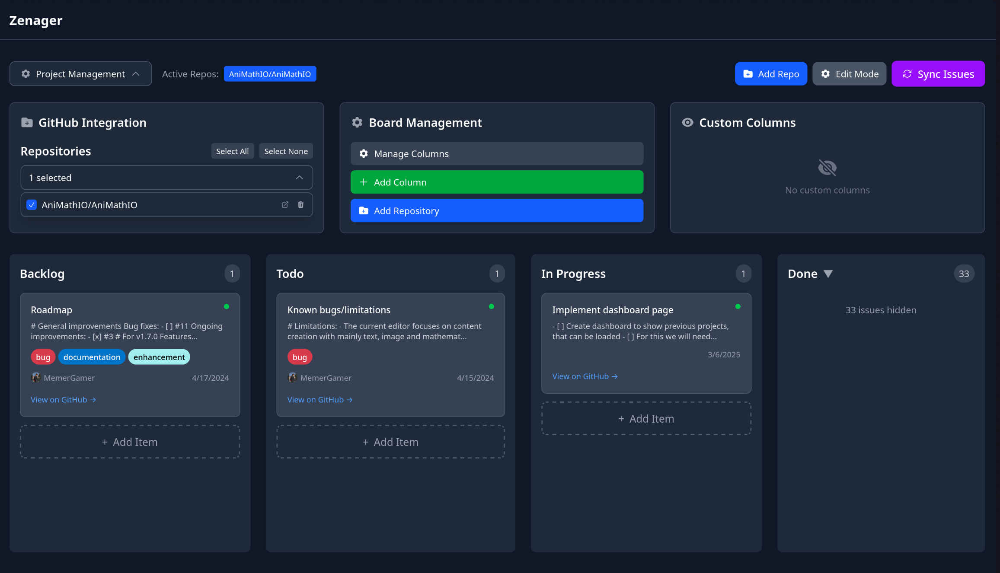

#  Zenager

<div align="center">
    
  <h3>A minimalistic Kanban board for project management with GitHub integration</h3>
</div>

## Features

- **GitHub Integration** - Import issues from GitHub repositories with filtering support
- **Drag & Drop** - Intuitive card and column reordering with visual feedback
- **Custom Columns** - Create and manage custom project columns beyond the standard workflow
- **Persistent State** - All data is automatically saved and restored between sessions
- **Edit Mode** - Toggle between view and edit modes for board customization
- **Multi-Repository** - Work with multiple GitHub repositories simultaneously
- **Issue Categorization** - Automatic categorization of issues based on state and labels
- **Custom Items** - Add custom tasks and items to any column
- **Responsive Design** - Clean, modern interface that works on all devices

> **Note:** All data is stored locally in your browser. No server-side storage or external databases are used.

## Quick Start with Docker

The easiest way to run Zenager is using Docker:

```bash
# Run with default port (2718)
docker run -p 2718:2718 kbalinthunor/zenager

# Run with custom port mapping
docker run -p 8080:2718 kbalinthunor/zenager
```

Then open your browser to `http://localhost:2718` (or your custom port).

## Development Installation

### Option 1: Docker Development

Run the development server in Docker with hot reload:

```bash
# Clone the repository
git clone https://github.com/MemerGamer/zenager.git
cd zenager

# Run development server in Docker
docker run -p 2718:2718 -v $(pwd):/app -w /app oven/bun:1.3.0-alpine bun dev
```

### Option 2: Local Development

1. Clone the repository:

   ```bash
   git clone https://github.com/MemerGamer/zenager.git
   cd zenager
   ```

2. Install Node.js using nvm:

   ```bash
   nvm install
   nvm use
   ```

3. Install dependencies with Bun:

   ```bash
   bun install
   ```

4. Start the development server:

   ```bash
   bun dev
   ```

## License

[LICENSE](./LICENSE)
